# Cover Art

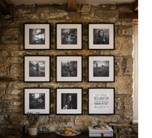

That the cover of this album would also be AI-generated was clear from the outset, as was the fact that I would invest substantial time in post-processing—not merely to inject human labor, but because digital image editing and photography are among my oldest creative pursuits. 
The greatest challenge lay in the deliberate orchestration of the uncanny valley effect: characteristic generative artifacts, such as the collage-like arrangement of props across the frame, were meant to expose its artificial nature; simultaneously, the overarching composition and meticulous attention to detail were intended to preclude any semblance of arbitrariness—and indeed, there is no detail in the image that does not fulfill a distinct function. This may appear cerebral, mannered, or over-engineered, yet for an AI, there is only semantics: in reality, a bouquet of flowers is simply a bouquet of flowers. In a generative image, however, it is either a prompted detail or a probability-weighted vector synthesized by the model; nothing exists without reason (even if that reason is not immediately intelligible to us).
 

## The Prismatic Vector Space
The image suggests a bifurcation between an ostensibly "real" room and nine—or rather eight—framed pictures that sequentially recount scenes from the protagonist's life. Individual props, such as car keys or a pencil, extend this "personal museum." In the context of the album's narrative arc, one might interpret the motif as an arrival at the long-dreamed-of "home."
Yet that is merely the surface. When one recognizes that everything is AI-generated—including the room and the rustic stone wall—the boundary between these ontological tiers collapses. Just as the narrative structure is fundamentally prismatic, so too is the cover art. It is a multidimensional vector or associative space, a kind of mood board, a visual manifestation of the album's semantics. A single image or prop can reference multiple tracks, and vice versa. In the central frame, we see the very house on whose interior wall the gallery hangs.

## The Woman in the Portraits

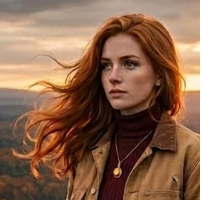

The same woman appears in three separate frames across the gallery. This is not the face of the singer—an AI has no face, and my artist profile is not an AI persona—but rather the lyrical first-person voice of the songs embodied in human form. The boundaries are, of course, porous (extending even to the incidental fact that "Jan" functions as a female given name in the English-speaking world). The visual reference was drawn from an older mood shot for the same novel project that originally influenced *[Hollow](./70_01_hollow.md)*. This *woman* therefore predated the first recorded track. Curiously, when Gemini rendered the instrumental demo for *[Journey](./70_12_journey.md)*, it autonomously dredged up this image from previous chat sessions and inserted it as the auto-generated cover art—it was the AI itself that closed this thematic loop.
 

## The Gallery

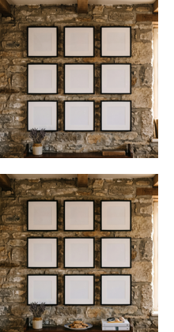

In the first step, I prompted the interior room with its natural stone wall and a geometrically precise 3×3 grid of framed passe-partouts, leaving the frames empty. It was obvious that a single prompt could never render both the environment and eight or nine distinct, flawless artworks simultaneously. Moreover, I relished the concept of selecting the framed images manually, thereby adopting the role of curator for this miniature gallery. 
In its initial generation, the model unprompted had placed two tattered, vintage-looking books (the kind sold in home-decor boutiques that nobody actually keeps in a domestic library) and a bouquet of lavender on the sideboard. I removed and replaced the books, but kept the lavender intact. My thought was that if the AI *desired* this bouquet for *its* home, it ought to have it. I subsequently prompted the addition of a plate of cookies, car keys, a pencil, seashells, and stacked books. The arrangement of the books and props is almost maniacally pristine. I actively resisted the impulse to introduce artificial disarray—which would have simulated a human presence—because this hyper-order captured the synthetic nature of the image with remarkable precision.
To achieve a resolution of 4 megapixels without relying on third-party upscaling tools, I worked in Google Flow (the consumer Gemini app caps output at 1 megapixel).
 

## The Framed Images

Each framed image was generated independently in a separate session. I consistently prompted for color versions so that I could perform the black-and-white conversion manually. To strip away the digital harshness characteristic of raw diffusion outputs, I employed heavy dodging and burning while pulling blacks up toward middle gray. As a result, the shadows "drown" without crushing the composition, yielding a washed-out, archival aesthetic reminiscent of early twentieth-century archaeological excavation photography. While I could have attempted to prompt this tonal quality directly, doing so would have surrendered creative control and risked wildly divergent model interpretations. Manual post-processing ensured a cohesive visual language throughout.  
Each image was designed to function autonomously as potential single or album cover art.
 

### Top | Left

A wall mounted with diplomas and accolades alongside a credenza displaying trophies and certificates—the tangible embodiment of the "CV of a titan." I later utilized this scene as the visual backdrop for the dining-table sequence in the *[Hollow](./70_01_hollow.md)* Spotify Canvas.
 

### Top | Center

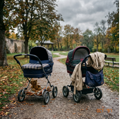

Two empty baby carriages, symbolizing the sisters from *[Shapeshifter](./70_02_shapeshifter.md)* and *[Agent](./70_09_agent.md)*. Draped over the right carriage is a trench coat—the identical coat featured in Center | Left.
 

### Top | Right

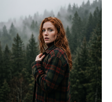

This composition plays subtly with the framing of Taylor Swift's *Evermore*, except that here, the protagonist turns around in surprise at the precise moment the shutter captures her.
 

### Center | Left

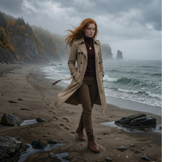

The protagonist in the "tailored coat" from *[Agent](./70_09_agent.md)* walking on the beach from *[Wrecker](./70_05_wrecker.md)*. The motif originates from an older mood-board image. Its subtle graphic-novel finish (especially around the edges and stones scattered across the sand) traces back to that source material, which I had initially prompted in a semi-realistic comic aesthetic.  
A classic generative glitch: the footprints in the sand point in the opposite direction of her stride.
 

### Center

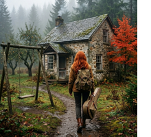

The narrative nexus: the "cottage in the pines" from *[Jobs](./70_04_jobs.md)*, overlaid with architectural details from *[Homecoming](./70_13_homecoming.md)*.
 

### Center | Right

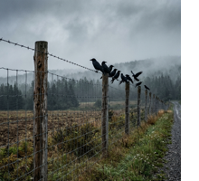

The perimeter fence from *[Reflection](./70_07_reflection.md)*, set against the woods of *[Shapeshifter](./70_02_shapeshifter.md)*.
 

### Bottom | Left

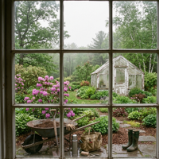

The garden from *[Window](./70_10_window.md)*. "YOU" remains invisible. We encounter only the attributes—gardening tools—which appear oddly displaced like theatrical props, reflecting the characteristic way a model renders an itemized list of objects without contextual integration. While intended here as a deliberate stylistic device, elsewhere I would have dismissed it as poor prompting.
 

### Bottom | Center

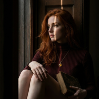

A highly staged portrait of the protagonist conceived to capture the isolation of *[Window](./70_10_window.md)* or the contemplative solitude of *[Fame](./70_11_fame.md)*.  
Trivia: because the woman in the source reference wore a jacket, I prompted "she wears only the sweater and the necklace"—and the AI interpreted "only" with absolute literalism. Fortunately, cropping the frame resolved the framing before it ventured into gratuitous exposure (and yes, this is the already cropped version).
 

### Bottom | Right - The Transparency Notice

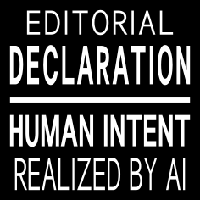

The final frame in the gallery—and with it, the Editorial Declaration—underwent a profound transformation.  
Originally, I intended to place a QR code linking directly to this GitHub repository. It would have served as an elegant poetic inversion: in a seemingly human world, the sole element of authentic human authorship would be a machine-readable barcode. Furthermore, it would have provided listeners on any DSP with an immediate gateway to my underlying intent. Unfortunately, digital streaming platforms strictly prohibit QR codes on album artwork. The same prohibition applies to URLs, badges (which I had also considered), and conventional overlay text. The sole loophole I discovered was that typography integrated organically as part of the image content itself is permitted. This sparked the concept of an Editorial Declaration styled as a typographic art print.  
"Editorial Declaration" foregrounds my role as publisher and curator, reading not as a compliance warning but as an artistic statement. "Human Intent realized by AI"—the entire genesis of the project in a nutshell.  
While the direct link to the repository is missing, I had to comply with platform distribution mandates. At the very least, the artwork honors my commitment to transparency right on the cover. My hope remains that curious listeners will feel compelled to dig deeper on their own initiative.  
Technically, it's a hand-made SVG.
 

### Outtakes

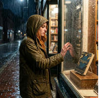

The selection of the eight framed artworks was not fixed from day one. There were alternatives. Early iterations included compositions featuring other human figures (a prom scene, two young girls playing in the sand). Developing this *visual vocabulary of alienation* was a process I had to undergo over time.
 

## Visibility
Because DSPs render album covers primarily as miniature thumbnails, the detailed content within each picture frame is inevitably lost at first glance. This is intentional. The cover art is designed to reward closer inspection, unveiling a dense microcosm of supplementary narrative clues. Even scaled down to a tiny square, the composition retains strong visual recognition: the 3×3 grid reads almost like a mobile application icon.

**[< Previous Page](./71_02_masks.md) - 24 - [Next Page >](./Q-AND-A.md)**

